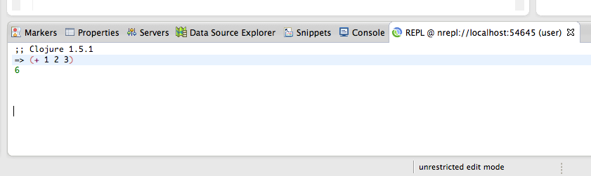
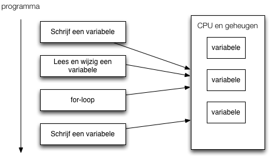
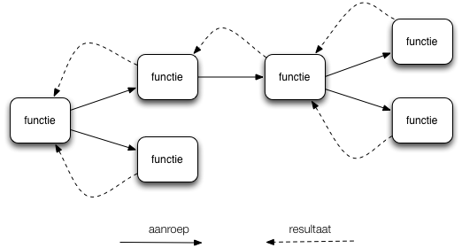

.notes landslide gastcollege.md --linenos=inline -c -r

# The Immutable Stack
04-10-2014

Martin van Amersfoorth

Michiel Borkent

---
# Schedule

* Intro (10 m.)
* Clojure crash course (20 m.)
* Web server (10+20 m.)
* Web client (10+20 m.)
* Database (10+20 m.)

---
# Intro

* Clojure
* Clojurescript
* Web techologies
** Ring, Compojure, Liberator
** React
* Datomic

---
# REPL
- Interactieve manier van ontwikkelen
- REPL: Read Eval Print Loop

		!clojure
		user=>                         <- prompt
---

# REPL
- Interactieve manier van ontwikkelen
- REPL: Read Eval Print Loop

		!clojure
		user=> (inc 1)                 <- expressie
		2                              <- resultaat

---

# REPL
- Interactieve manier van ontwikkelen
- REPL: Read Eval Print Loop

		!clojure
		user=> (println "hello world") <- expressie
		hello world                    <- side effect
		nil                            <- resultaat
---

# Ontwikkelomgevingen
- Voor Eclipse-gebruikers: CounterClockwise plugin: <https://code.google.com/p/counterclockwise/>
- CCW is verreweg de beste en meest actief ontwikkelde plugin vergeleken met andere IDES+plugins
- Mocht je een extra uitdaging willen: Emacs + nrepl.el
- Recent ook voor Intellij: cursive clojure plugin

---

# CounterClockwise
- Biedt per Clojure-project een REPL in Eclipse
- Biedt Leiningen ondersteuning
- Leiningen is Maven met een Clojure-schil eromheen (+ veel meer)
- Nieuw Clojure project

---

# CounterClockwise
- Inhoud `project.clj`, vergelijkbaar met `pom.xml` van Maven, maar
  dan Clojure-notatie ipv XML
- Clojure is zelf gewoon een dependency.
- Versie is dus per project
  makkelijk in te stellen.

		!clojure
		(defproject gastcollege "0.1.0-SNAPSHOT"
  			:description "FIXME: write description"
  			:url "http://example.com/FIXME"
  			:license {:name "Eclipse Public License"
           	          :url "http://www.eclipse.org/legal/epl-v10.html"}
  			:dependencies [[org.clojure/clojure "1.5.1"]])
---

# REPL starten voor project
Run as Clojure application

---

# Functieaanroep

    !clojure
    (inc 1)

in plaats van:

    !javascript
    inc(1)

Dit noem je ook wel prefix-notatie.

---

# If-expressie

    !clojure
    (if (< (rand-int 10) 5)
      "Getal kleiner dan 5"
      "Getal groter dan of gelijk aan 5")

---

# Let
    !clojure
    (let [x (+ 1 2 3)
          y (+ 4 5 6)
          z (+ x y)]
      z) ;;=> 21

---

# Terug naar wat is FP?
Imperatief programmeren
=
Place oriented programming

---

# Terug naar wat is FP?
Functioneel programmeren
=
Value oriented programming

---
# Pure functies
Conceptueel zoals wiskundige functie:

- gegarandeerd dezelfde output bij dezelfde input
- een functie-aanroep kan dus altijd vervangen worden door zijn uitkomst
- geen (serieuze) side effects (IO, mutatie van objecten, etc)

---
# Pure functies
De meeste functies in Clojure zijn puur.

    !clojure
    (inc 10) ;;=> 11
    (inc 11) ;;=> 12
    (count "foo") ;;=> 3
    (count "dude") ;;=> 4
    (str "foo" "bar") ;;=> "foobar"

---
# Pure functies
Niet-pure functies zijn echter gewoon
mogelijk (i.t.t. Haskell)

    !clojure
    (rand-int 10) ;;=> 7
    (rand-int 10) ;;=> 0
    (time (inc 1)) ;;=>
    "Elapsed time: 0.022 msecs" <- side effect
    2                           <- resultaat
    user=> (time (inc 1))
    "Elapsed time: 0.024 msecs" <- side effect
    2                           <- resultaat

- Waarom zijn `rand-int` en `time` niet puur?
- NB: `time` is een speciaal soort functie, nl. een macro

---

# Pure functies
- Makkelijker testbaar
- Geen afhankelijkheid van globale state (bv attributen van een klasse
  of object)
- Dus makkelijker lokaal uit te proberen (REPL) en over te redeneren
- Veel aanroepen van pure functies zijn makkelijker te parallelliseren, omdat ze onafhankelijk van elkaar kunnen draaien
- Compiler kan optimaliseren (Haskell, C, …)
- Clojure gebruikt puurheid van functies in combinatie met
  concurrency-mechanismen (atoms, refs, ...)

---
# Voorbeeld atom + pure functies

    !clojure
    (def game-state (atom {:score 0}))

    (defn increase-score [old-state points]
    (update-in old-state [:score] + points))

    ;; test:
    (increase-score {:score 40} 20) ;;=> {:score 60}

    (defn score! []
      (swap! game-state increase-score 20))

    @game-state ;;=> {:score 0}
    (score!)
    @game-state ;;=> {:score 20}
    (score!)
    @game-state ;;=> {:score 40}

---
# Voorbeeld parallellisatie
    !clojure
    (defn reverse-str [s]
      (apply str
             (reverse s)))

    (reverse-str "foo") ;;=> "oof"

Sequentieel

    !clojure
    (map reverse-str ["foo" "bar" "baz"])
    ;;=> ("oof" "rab" "zab")

Parallel (1 letter verschil)

    !clojure
    (pmap reverse-str ["foo" "bar" "baz"])
    ;;=> ("oof" "rab" "zab")

---
# Hogere orde functie
1. Functie die een of meer functies als invoer heeft
2. Of: functie die een andere functie oplevert (komen we vandaag niet
   aan toe)

---
# Hogere orde functie: map
    !clojure
    (map inc [1 2 3]) ;;=> (2 3 4)

- Invoer-functie is hier `inc`
- Past invoerfunctie toe op elk element in een collectie.
- Levert een nieuwe collectie op.

---
# Hogere orde functie: filter
    !clojure
    (odd? 1) ;;=> true
    (odd? 2) ;;=> false
    (range 10) ;;=> (0 1 2 3 4 5 6 7 8 9)
    (filter odd? (range 10)) ;;=> (1 3 5 7 9)

- Invoer-functie is hier `odd?`
- filtert de elementen uit een collectie waarvoor functie 'logisch
  waar' oplevert
  (In Clojure is alles behalve `nil` en `false` logisch waar)

---
# Hogere orde functie: reduce
    !clojure
    (reduce + [1 2 3 4 5]) ;;=> 15

Stappen:

    !clojure
    (reduce + [1 2 3 4 5])
    (+ 1 2) ;;=> 3
    (reduce + [3 3 4 5])
    (+ 3 3 ) ;;=> 6
    (reduce + [6 4 5])
    (+ 6 4) ;;=> 10
    (reduce + [10 5])
    (+ 10 5) ;;=> 15
    15
