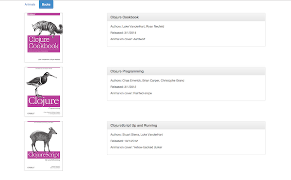
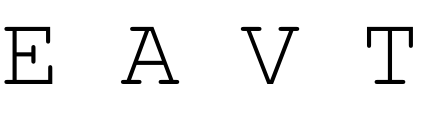
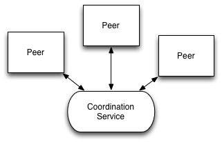

.notes landslide presentation.md --linenos=inline -c -r -w

# The Immutable Stack
04-10-2014 (dierendag)

## Martin van Amersfoorth

[@mamersfo](https://www.twitter.com/mamersfo)

## Michiel Borkent

[@borkdude](https://www.twitter.com/borkdude)

---
# Schedule

* Intro (10 m.)
* Clojure crash course (20 m.)
* REST API (10+20 m.)
* User interface (10+20 m.)
* Database (10+20 m.)

---
# Intro

# Clojure(Script)
# Immutable Stack

* Datomic
* Ring
* Compojure
* Liberator
* ReactJS: Om or Reagent

+

* many more

# Examples

* Matchmaker
* Lipton

---
# Clojure crash course

---
# Clojure crash course

# REPL
- Interactive development: Read Eval Print Loop

		!clojure
		user=>                         <- prompt

- Start one by `lein repl`
  or in IntelliJ

---
# Clojure crash course

In the REPL we will cover the following basics:

* Clojure basics and special forms
    - if
    - let
    - function call
    - function definition

---
# Clojure crash course

# If

    !clojure
    (if (< (rand-int 10) 5)
      "Smaller than 5"
      "Greater or equal than 5")

---
# Clojure crash course

# Let
    !clojure
    (let [x (+ 1 2 3)
          y (+ 4 5 6)
          z (+ x y)]
      z) ;;=> 21

---
# Clojure crash course

# Function call

    !clojure
    (inc 1) ;;=> 2

instead of

    !javascript
    inc(1) // 2

It is called prefix notation

---
# Clojure crash course

# Function definition
    !clojure
    (def my-fun (fn [x]
                  (+ x 2)))

    ;; same as:
    (defn my-fun [x]
      (+ x 2))

---
# Clojure crash course

Literals, symbols and keywords

    !clojure
    1     ;; integer literal
    "foo" ;; string literal
    'foo  ;; quoted symbol
    foo   ;; symbol (will evaluate to value bound to foo)
    :foo  ;; keyword, more or less a constant, often used as key in hashmap
    {:a 1, :b 2} ;; map literal

---
# Clojure crash course

* Clojure collections
    - vectors
    - maps
    - lists
    - sets

* Functions on data structures

---
# Clojure crash course

Vectors

    !clojure
    (def v1 (vector 1 2 3 4))
    (def v2 [1 2 3 4])
    (= v1 v2) ;; true
    (get v1 0) ;; 1
    (get v1 3) ;; 4
    (get v1 4) ;; nil
    (v1 0) ;; 1
    (v1 3) ;; 4
    (conj v1 5) ;; [1 2 3 4 5]

---
# Clojure crash course

Maps

    !clojure
    (def m1 {:a 1 :b 2})
    (get m1 :a) ;; 1
    (get m1 :b) ;; 2
    (m1 :a) ;; 1
    (:a m1) ;; 1
    (:c m1) ;; nil
    (assoc m1 :c 3) ;; {:c 3, :b 2, :a 1}

---
# Clojure crash course

Lists.
Used mostly for representing code (for example in macros).

    !clojure
    (def expr (list 'println 1 2 3)) ;; (println 1 2 3), unevaluated
    (eval expr) ;; prints 1 2 3, normally we don't do this
    (conj (list 1 2 3) 4) ;; (4 1 2 3)

---
# Clojure crash course

Sets

    !clojure
    (def s1 #{1 2 3})
    (contains? s1 1) ;;=> true
    (contains? s1 4) ;;=> false
    (conj s1 4) ;;=> #{1 2 3 4}
    (disj s1 3) ;;=> #{1 2}

---
# Sequence abstraction

Clojure collections implement a sequence interface, so you can apply general sequences functions.

Examples: `first`, `rest`, `map`, `filter`, `remove`.

    !clojure
    (def v1 [1 2 3 4])
    (first v1) ;; 1
    (rest v1) ;; (2 3 4)
    (map v1 inc) ;; (2 3 4 5)
    (filter v1 odd?) ;; (1 3)
    (remove v1 odd?) ;; (2 4)

---
# Mutable state

Atoms are mutable references to immutable values.

One of 4 kinds of mutable references in Clojure.

Pure functions are used to atomically transform immutable value stored in reference.

    !clojure
    (def game-state (atom {:score 0}))

    (defn increase-score [old-state points]
    (update-in old-state [:score] + points))

    ;; test:
    (increase-score {:score 40} 20) ;;=> {:score 60}

    (defn score! []
      (swap! game-state increase-score 20))

    @game-state ;;=> {:score 0}
    (score!)
    @game-state ;;=> {:score 20}
    (score!)
    @game-state ;;=> {:score 40}

---
# Clojure crash course

Use the [Clojure cheat sheet](http://clojure.org/cheatsheet)

---
# REST API

---
# REST API

* Ring: HTTP abstraction
* Compojure: routing
* Liberator: expose data as resources

---
# Ring

* HTTP abstraction library
* Inspired by WSGI (Python) and Rack (Ruby)
* Represents requests and responses as maps
* [SPEC](https://github.com/ring-clojure/ring/blob/master/SPEC)
* Middleware

Example:

    !clojure
    (defn handler [req]
      {:status 200
       :body "{:a 1, :b 2}"
       :headers {"Content-Type" "application/edn"})

    (defn run-server []
      (run-jetty #'handler {:port 8080}))

---
# Compojure

* Routing library for Ring
* [Specific destructuring](https://github.com/weavejester/compojure/wiki/Destructuring-Syntax)

Example:

    !clojure
    (defroutes main-routes
      (GET "/" [] (index-page))
      (GET "/animals/:id" [id]
        (find-animal id))
      (route/resources "/")
      (route/not-found "Page not found"))

    (def app
      (-> (handler/site main-routes)
        (wrap-base-url)))

---
# Liberator

* Library for exposing data as resources
* Compliant with relevant requirements of HTTP specification RFC-2616
* Inspired by Erlang Webmachine

Example:

    !clojure
    (defresource hello-world
      :available-media-types ["text/plain"]
      :handle-ok "Hello, world!")

[Decision tree](http://clojure-liberator.github.io/liberator/assets/img/decision-graph.svg)

---
# Putting it all together

Code example from [`api.clj`](https://github.com/borkdude/immutable-webapp/blob/master/src/webapp/api.clj)

---
# Assignments

* We'll use an [example](https://github.com/borkdude/immutable-webapp) project to work on.
* Follow the instructions in the README if you haven't yet setup a Clojure environment.
* We have USB-sticks with IntelliJ + Cursive for Mac, Linux and Windows
* Each assignment is based on a git branch and can be worked on independently
* The answers are provided in the example's master branch

---
# Assignment 1

`$ git checkout rest-api`

Add endpoints / liberator resources to `api.clj`

* GET
    * all books
    * one specific book
* POST
    * a new book
* DELETE
    * a book
* PUT
    * to change book details

Test it with curl, browser or other REST client

---
# User interface

---
# User interface

* Clojurescript
    - Clojure compiled to javascript
* React
    - V of MVC
    - Component based
    - Components can have props and inner state
    - Virtual DOM

* ClojureScript abstractions
    - Om
    - Reagent

---
# ClojureScript abstractions

## Om
* Opinionated library by David Nolen
* App-state based on one atom
* Cursor based access (kind of a functional lens / zipper)
* Components can access shared state, app state or local state
* Communication between components via app-state, handlers or core.async
* Explicit hooks to React lifecycle
* Follows React semantics closely (e.g. local state changes cause re-rendering)

See [examples](https://github.com/swannodette/om/tree/master/examples)

---
# ClojureScript abstractions

## Reagent
* Minimalistic ClojureScript interface to React
* State is saved in RAtom, like clojure.core/atom, but keeps track of derefs
* Components can deref RAtom and will be re-rendered when RAtom changes
* Less verbose than Om
* You can hook to React lifecycle, but often don't need to

See [examples](http://holmsand.github.io/reagent/)

---
# Assignment 2

`$ git checkout user-interface`

Implement the following user story.

When user clicks on button with text "Books" a screen will appear that lists all books with:

* cover
* title
* authors
* release data
* animal on cover

The screen could look like the example in the next slide.

---
# Example book screen

---
# Database
---

# Datomic: deconstructing the database

## relations | objects => facts

Information Model

## place | time => values

State Model

## client | server => peers

Distribution Model

## reads | writes => reaction

Coordination Model

---

# Information Model

* Traditional: relations vs. objects, impedance mismatch

* Datomic: facts, EAVT, Datoms - combined with a declarative, relational query language to store and retrieve those facts (no SQL by the way)

---

# State Model

* Traditional: update in place, contention, "the basis problem"

* Datomic: Accretion of immutable facts, the database as an expanding value, otherwise: [excision](http://blog.datomic.com/2013/05/excision.html)

---

# Distribution Model

* Traditional: Client-server, partitions between service providers and service requesters

* Datomic: Peers and Storage, and Transactors too, empower applications by coordinating change and storage

---

# Coordination Model

# Deconstructing the Coordination Model

* Traditional: heavy coordination for reads and writes, need to poll for novelty

* Datomic: splits "perception" (reads) and "process" (writes), reactive - not polling

---
# Datalog in 6 minutes

---

# Query Anatomy

Clojure

	!clojure
	(q ('[:find ...
	      :in ...
	      :where ...]
	      input1
	      ...
	      inputN))

.notes: :where - constraints, :in - inputs, :find - variables to return

---

# Variables and Constants

Variables

* ?customer
* ?product
* ?orderId
* ?email

Constants

* 42
* :email
* "john"
* :order/id
* \#instant "2012-02-29"

---

# Data Pattern: E-A-V

	!html
	-------------------------------------------
	| entity | attribute | value              |
	-------------------------------------------
	| 42     | :email	  | jdoe@example.com  |
	| 43     | :email     | jane@example.com  |
	| 42     | :orders    | 107               |
	| 42     | :orders    | 141               |
	-------------------------------------------

Constrain the results returned, binds variables

	!clojure
	[?customer :email ?email]
-> jdoe@example.com, jane@example.com

	!clojure
	[42 :email ?email]
-> jdoe@example.com

---

# Data Pattern: E-A-V

	!html
	-------------------------------------------
	| entity | attribute | value              |
	-------------------------------------------
	| 42     | :email	  | jdoe@example.com  |
	| 43     | :email     | jane@example.com  |
	| 42     | :orders    | 107               |
	| 42     | :orders    | 141               |
	-------------------------------------------

What attributes does customer 42 have?

	!clojure
	[42 ?attribute]
-> :email, :orders

What attributes and values does customer 42 have?

	!clojure
	[42 ?attribute ?value]
-> :email - jdoe@example.com, :orders - 107, 141

---

# Where Clause

Where to put the data pattern?

	!clojure
	[:find ?customer
	 :where [?customer :email]]

Implicit Join

	!clojure
	[:find ?customer
	 :where [?customer :email]
	        [?customer :orders]]

---

# Input(s)

	!clojure
	(q '[:find ?customer :in $ :where [?customer :id] [?customer :orders]]
       db)

Find using $database and ?email:

	!clojure
	(q '[:find ?customer :in $ ?email :where [?customer :email ?email]]
	    db "jdoe@example.com")

---

# Predicates

Functional constraints that can appear in a :where clause

	!clojure
	[(< 50.0 ?price)]

Find the expensive items

	!clojure
	[:find ?item
	 :where [?item :item/price ?price]
	        [(< 50.0 ?price)]]

---

# Aggregates

The syntax is incorporated in the :find clause:

    !clojure
    [:find ?a (min ?b) (max ?b) ?c (sample 12 ?d) :where ...]

The list expressions are aggregate expressions.
Query variables not in aggregate expressions will group the results and appear intact in the result.

The included aggregation functions are:

* min, max
* count, count-distinct
* sum, avg, median
* variance, stddev
* rand

---

# Functions

	!clojure
	[(shipping ?zip ?weight) ?cost]

Call functions by binding inputs:

	!clojure
	[:find ?customer ?product
	 :where [?customer :shipAddress ?address]
	        [?address :zip ?zip]
	        [?product :product/weight ?weight]
	        [?product :product/price ?price]
	        [(Shipping/estimate ?zip ?weight) ?shipCost]
	        [(<= ?price ?shipCost)]]

Or: find me the customer/product combinations where the shipping cost dominates the product cost.

---

# Assignment 3

`$ git checkout database`

Test the datalog queries in `webapp.query_test.clj`.

You'll also get instructions how to perform the tests and how use the
REPL to build your queries, in order to:

* Query by attribute
* Query by attribute with param
* Query with predicats
* Query with joins
* Query with functions

---

# (thanks!)
